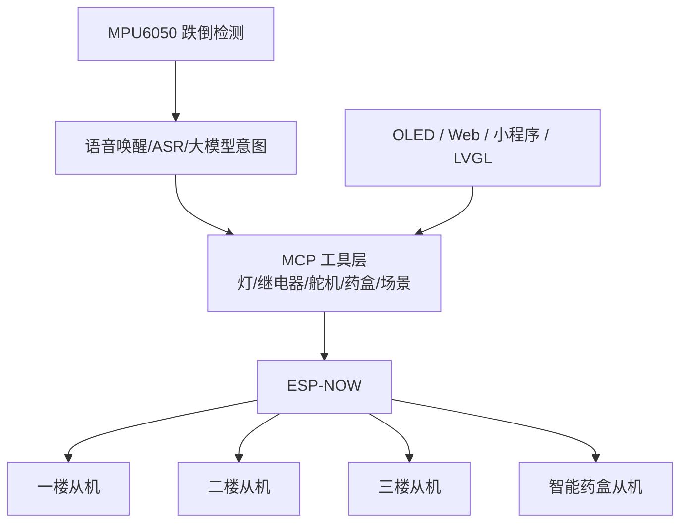
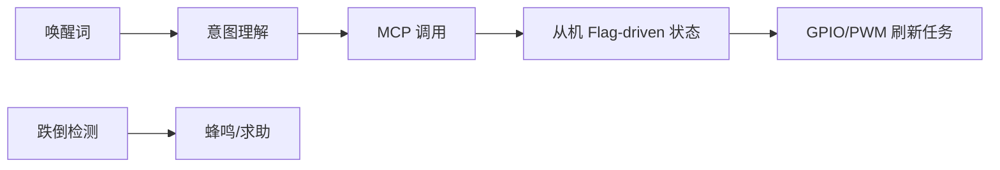

# Esp32_Yinling_Care

「银龄智享」智慧养老主机固件：基于小智 AI 框架二次开发，MCP 工具协议 + ESP-NOW 一主机多从机，语音控制全屋设备与跌倒守护。

## 系统架构图

```mermaid
flowchart TB
  VOICE[语音唤醒/ASR/大模型意图]
  MCP[MCP 工具层\n灯/继电器/舵机/药盒/场景]
  NOW[ESP-NOW]
  VOICE --> MCP --> NOW
  NOW --> S1[一楼从机]
  NOW --> S2[二楼从机]
  NOW --> S3[三楼从机]
  NOW --> MED[智能药盒从机]
  SEN[MPU6050 跌倒检测] --> VOICE
  UI[OLED / Web / 小程序 / LVGL] --> MCP
```

## 功能框图

```mermaid
flowchart LR
  WAKE[唤醒词] --> NLU[意图理解]
  NLU --> TOOL[MCP 调用]
  TOOL --> FLAG[从机 Flag-driven 状态]
  FLAG --> GPIO[GPIO/PWM 刷新任务]
  FALL[跌倒检测] --> ALARM[蜂鸣/求助]
```

## 远程

origin → https://github.com/linxi27667/Esp32_Yinling_Care.git
